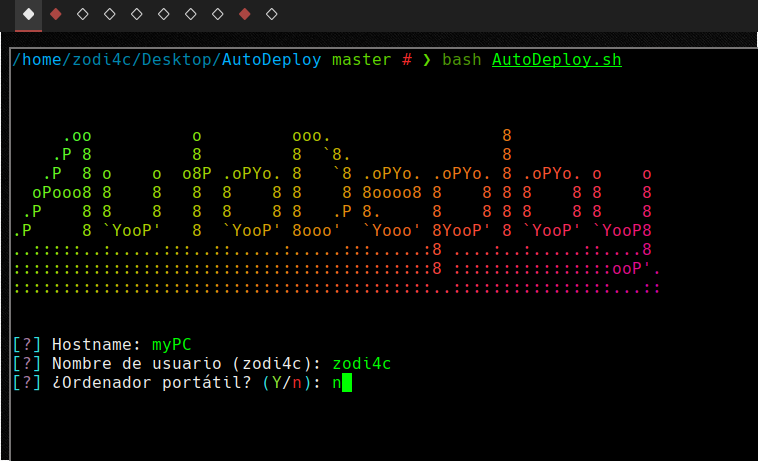
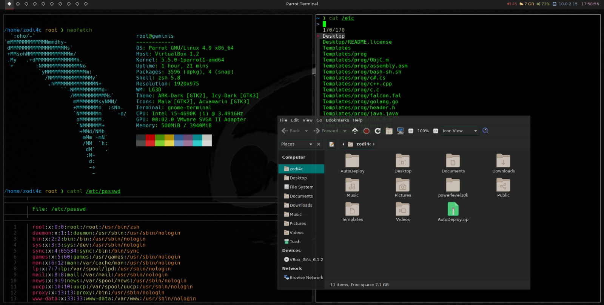

# AutoDeploy

**AutoDeploy** es una utilidad que permite instalar una capa de personalización sobre el entorno gráfico que se incluye por defecto en Parrot OS. Esta incluye varios plugins, utilidades y atajos que permiten sacar un mayor rendimiento del entorno de trabajo. Esta es la personalización que tengo instalada en todos mis equipos: no pretende ser una solución que se adapte a la forma de trabajo y/o gusto de todo el mundo, pero puede servir como base para ser configurado al gusto de cada uno.

Utilidades
==========

Una lista (incompleta) de las utilidades que se incluyen en esta capa de personalización son:
- sxhkd / bspwm
- compton
- polybar
- zsh + powerlevel10k
  - lsd
  - bat
  - fzf
- Oh my Tmux!

Uso del instalador
==================

Para utilizar el script, basta con ejecutarlo como cualquier otro script de Bash:

  bash AutoDeploy.sh

Una vez indicados los datos solicitados al principio del proceso de instalación, el resto de la ejecución debería de realizarse automáticamente sin necesitar interacción del usuario. Si algún paso del error de instalación falla, se almacena una copia del error en el fichero **error.log** para que estos puedan ser solucionados posteriormente de forma manual.
